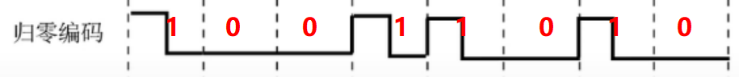

# 物理层

## 码元, 波特, 速率, 带宽

<table>
  <thead>
    <tr>
      <th style="text-align:left">&#x540D;&#x8BCD;</th>
      <th style="text-align:left">&#x89E3;&#x91CA;</th>
    </tr>
  </thead>
  <tbody>
    <tr>
      <td style="text-align:left"><b>&#x7801;&#x5143;</b>
      </td>
      <td style="text-align:left">M&#x8FDB;&#x5236;&#x7801;&#x5143; : &#x6709;M&#x79CD;&#x9AD8;&#x4F4E;&#x4E0D;&#x540C;&#x7684;&#x4FE1;&#x53F7;&#x6CE2;&#x5F62;
        ( M&#x79CD;&#x79BB;&#x6563;&#x72B6;&#x6001; )</td>
    </tr>
    <tr>
      <td style="text-align:left"><b>&#x901F;&#x7387;</b>
      </td>
      <td style="text-align:left">&#x5206;&#x4E3A; <b>&#x7801;&#x5143;&#x4F20;&#x8F93;&#x901F;&#x7387;</b> &#x548C; <b>&#x4FE1;&#x606F;&#x4F20;&#x8F93;&#x901F;&#x7387;</b> 
      </td>
    </tr>
    <tr>
      <td style="text-align:left"></td>
      <td style="text-align:left">
        <ul>
          <li>&#x7801;&#x5143;&#x4F20;&#x8F93;&#x901F;&#x7387; : &#x5355;&#x4F4D;&#x662F;<b>&#x6CE2;&#x7279; ( baud ), </b>&#x4E00;&#x6CE2;&#x7279;&#x8868;&#x793A;&#x6BCF;&#x79D2;&#x949F;&#x4F20;&#x8F93;&#x4E00;&#x4E2A;&#x7801;&#x5143;</li>
          <li>&#x4FE1;&#x606F;&#x4F20;&#x8F93;&#x901F;&#x7387; : &#x53C8;&#x53EB;&#x6BD4;&#x7279;&#x7387;,
            &#x5355;&#x4F4D;&#x662F;<b>&#x6BD4;&#x7279;/&#x79D2; ( bit/s )</b>
          </li>
        </ul>
      </td>
    </tr>
    <tr>
      <td style="text-align:left"><b>&#x5E26;&#x5BBD;</b>
      </td>
      <td style="text-align:left">&#x7F51;&#x7EDC;&#x4E2D;&#x4E00;&#x70B9;&#x5230;&#x53E6;&#x4E00;&#x70B9;&#x6240;&#x80FD;&#x901A;&#x8FC7;&#x7684;&#x6700;&#x9AD8;&#x6570;&#x636E;&#x7387;</td>
    </tr>
  </tbody>
</table>

## 奈奎斯特定理和香农定理

**奈奎斯特定理** : 

> 在理想低通条件下, 为了避免码间串扰, **极限码元传输速率**为 **2W Baud ,** 其中W为信道带宽, 单位是**HZ**

理想低通信道下的**极限数据传输率**  = \( V是码元的种类数 \)

$$
2W\times \log _2V\,\,\left( b/s \right)  \tag{1}
$$

**香农定理** : 

**信噪比 :**  

$$
信噪比 = \frac{信号平均功率}{噪声平均功率}, 常记为 \frac{S}{N}, 并用分贝(db)作为度量单位
$$

$$
信噪比(db) = 10 log _{10} (\frac{S}{N})\tag{2}
$$

**香农定理 :** 

在带宽有限且**有噪声**的信道中, 为不产生误差, 信息的数据传输速率的上限值为 : 

$$
W\log _2\left( 1+\frac{S}{N} \right)  (b/s) \tag{3}
$$

> 香农定理和奈奎斯特定理都是限制了数据传输速率, 不同的是前者是无噪声条件下, 后者是有噪声条件下

## 编码与调制

